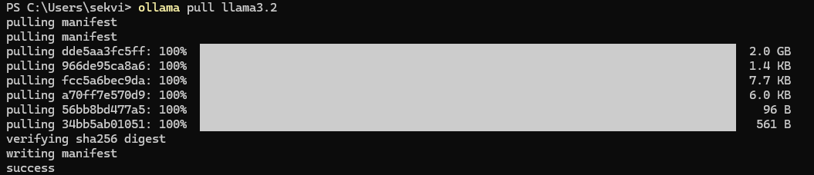
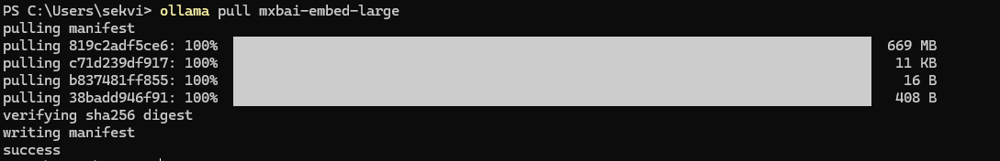

### Setup
1. Please prepare Ollama for your pc
2. Please prepare model that you want to operate with fe. llama3.2

### Pulling model
```
ollama pull {{ model_name }}
```
When download has finished you should see something like below


### Pull embedding model for vector db
```
ollama pull mxbai-embed-large
```

After setup you should see below.
